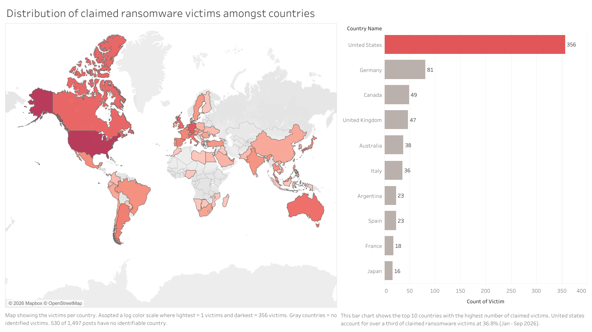
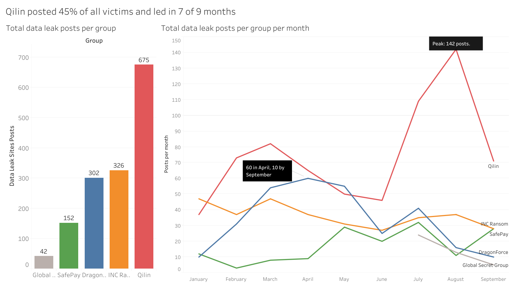
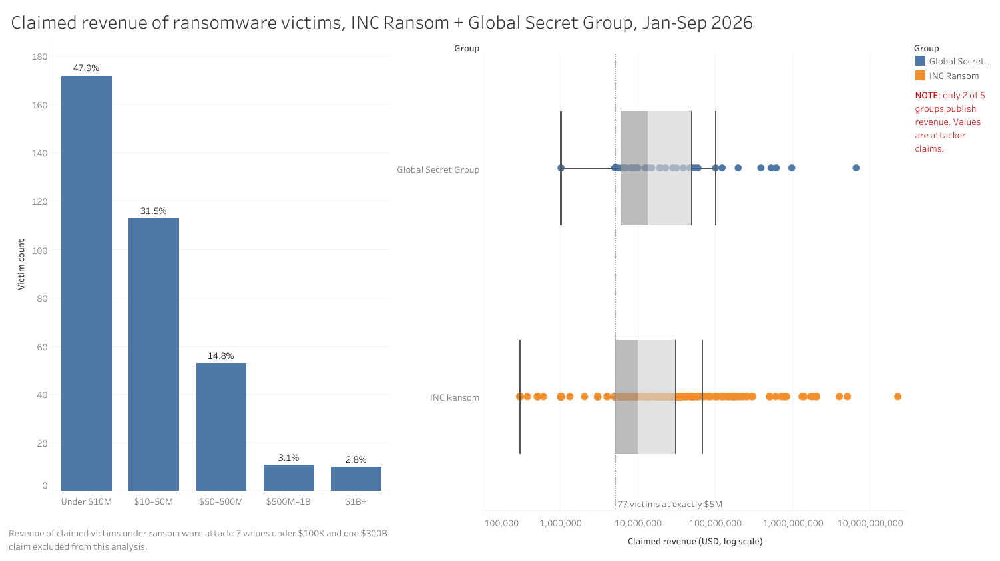
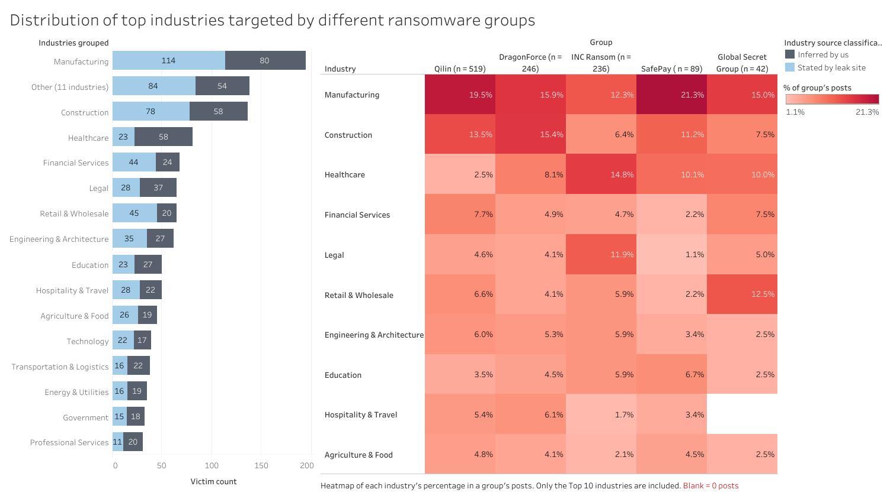
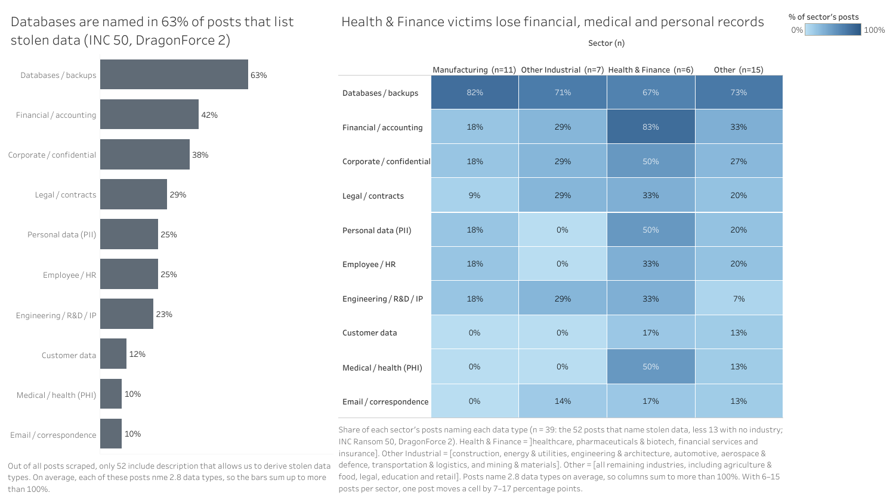
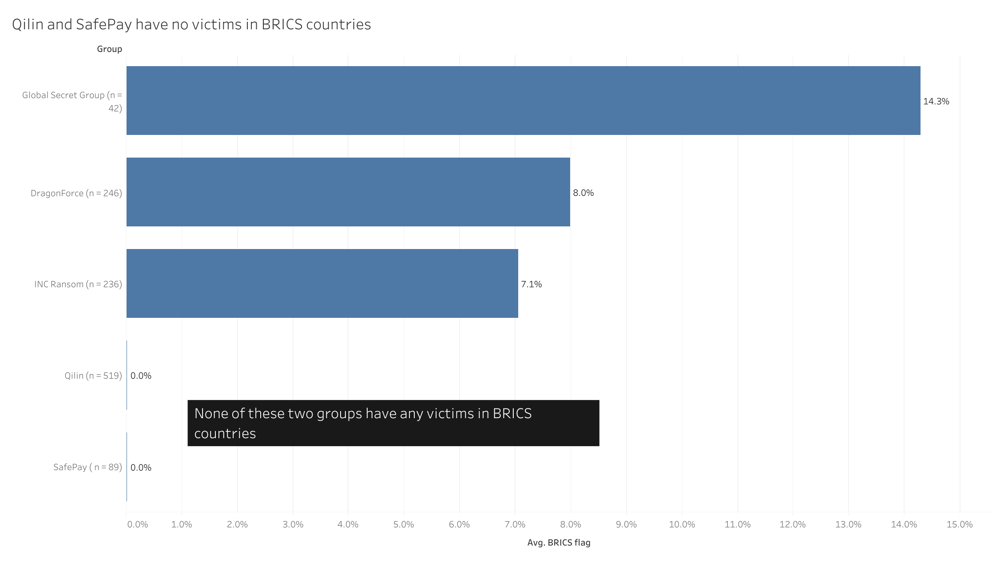
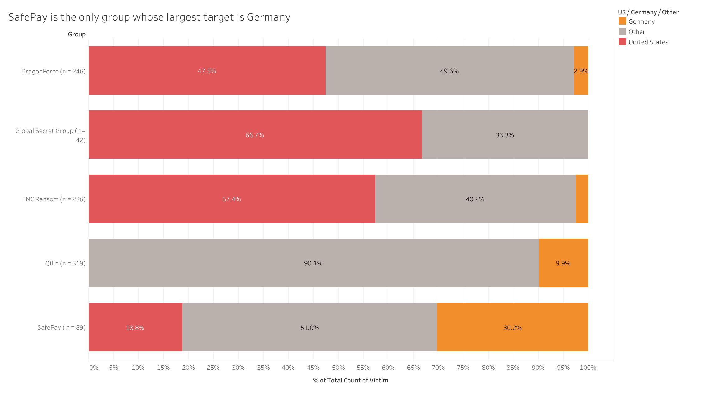
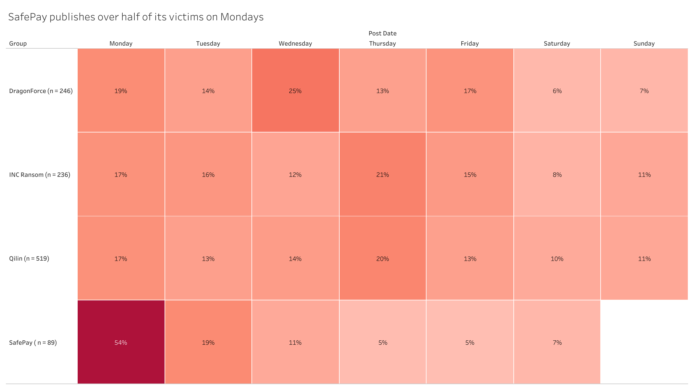

## Q1. What countries are most Targeted By Ransomware Actors?

The United States is by the most targeted by ransomware actors, with 356 claimed ransomware victims. This can be seen from \autoref{fig:q1} on the choropleth where United States is the darkest region and in the bar chart where United States leads the other countries. Across the 1,497 leak-site posts scraped across five ransomware groups, 967 of these posts can be tied to a country. United States accounts for 36.8% of all identifiable claimed victims. This is more than four times Germany in second place (8.4%). From \autoref{fig:q1}, we can also see that nine of the top ten targeted countries are high-income economies in North America, Western Europe and Asia-Pacific, with the exception of Argentina.

One limitation when analyzing this question is that Qilin does not state victim countries, so we inferred them from website domains. This left 463 of its 675 victims unidentified, most of them on `.com` domains. These figures also only account for victims that ransomware attackers choose to publish and are unverifiable, not all attacks that actually happen.

{#fig:q1 width=90%}

## Q2. Why are some countries more targeted than others?

Organisations from higher income countries could be targeted because they have more revenue and more comprehensive cyberthreat insurance coverage to pay higher ransoms. Additionally, ransomware groups also favour high GDP markets with stricter data protection laws, giving ransomware organizations stronger extortion leverage as victims are pressured to pay. The United States, Canada, United Kingdom and Australia make up 51% of our identifiable victims, and the European Union countries in the top ten are covered by the General Data Protection Regulation (GDPR). Lastly, the presence of "safe harbours" prevents some countries from being attacked. Russia-linked groups such as Qilin avoid Commonwealth of Independent States (CIS) members to reduce domestic legal exposure [@dexpose]. Our dataset has no victims in Russia, Belarus or Kazakhstan even though we have data from Qilin (grey in \autoref{fig:q1}).

## Q3. Which ransomware group is the most prolific or successful?

**Qilin** is the most prolific group in our dataset. It published 675 of the 1,497 victim posts (45%) between January and September 2026, more than INC Ransom (326) and DragonForce (302) combined, with SafePay (152) and Global Secret Group (42) well behind (\autoref{fig:q3}).

Qilin's lead is sustained, not a single spike. It posted the most victims in seven of the nine months, never fell below 37 posts a month, and surged from 46 in June to 109 in July and a peak of 142 in August. By contrast, DragonForce faded from 60 posts in April to 10 in September, and INC Ransom stayed flat at 27–47 a month.

Leak sites do not reveal whether a ransom was paid, so "success" can only be inferred. One indirect signal is post removal, which can follow a payment or negotiation. Aggregators recorded about 1,020 Qilin posts in this period but only 675 remain listed, so roughly a third were taken down, against 3–9% for SafePay, DragonForce and INC Ransom. This is an upper bound, because some missing posts are retitled entries or aggregator errors. It also means 675 understates Qilin's true volume.

Finally, Qilin is the leading poster in 18 of our 26 industry categories, so it does not depend on a single victim niche.

{#fig:q3 width=90%}

## Q4. What is so unique about these ransomware actors' TTP that makes them so "successful"?

Most of these groups' techniques are not unique: all of them steal data before encrypting and publish victims who refuse to pay (double extortion). What sets Qilin, the most prolific group in Q3, apart is scale. Dragos attributes its lead to "the scale of its affiliate network and its ability to leverage multiple access vectors rather than any single technical innovation" [@dragos].

**Affiliate economics.** Qilin runs Ransomware-as-a-Service (RaaS) with a reported affiliate share of up to 85% of each ransom [@dexpose]. Access brokers, lateral-movement operators and encryption crews work as separate tiers, which lets it run dozens of intrusions at once [@cyble]. That explains its 675 posts.

**Fast exploitation of edge devices.** Affiliates mainly enter through internet-facing appliances and compromised credentials (MITRE ATT&CK T1190, T1078) [@dragos]. In June 2026, Arctic Wolf investigated several intrusions that began with CVE-2026-0257, an authentication bypass in Palo Alto GlobalProtect [@arcticwolf]. The attackers dumped LSASS and NTDS credentials (T1003), moved laterally with PsExec and RDP (T1021), cleared event logs (T1070) and, in some cases, disabled Microsoft Defender (T1562) before encrypting (T1486). Some affiliates also exfiltrated data to MEGA with Rclone (T1567) while others encrypted without stealing anything.

**Layered pressure.** Qilin affiliates have threatened to notify victims' regulators [@dexpose], and its site runs countdown timers on unpublished victims. About a third of its posts later disappear (Q3), which is consistent with delisting after negotiation.

The other groups succeed with different playbooks:

| **Group**           | **Reported by researchers**                                                                                                                                                                  | **Our scraped data**                                                                                                                                |
| ------------- | ---------------------------------------- | ---------------------------------------- |
| INC Ransom          | Specialises by sector, preferring law firms and other holders of sensitive data [@cyble]                                                                                                     | Leads our legal and healthcare categories; publishes revenue for every victim; only 50% of posts are labelled "Encrypted"                           |
| DragonForce         | "Cartel" branding; a data audit service that mines stolen datasets over 300 GB for leverage [@checkpoint]; one affiliate hid command-and-control traffic in Microsoft Teams relays [@dragos] | States the stolen data volume for every victim (median 123 GB)                                                                                      |
| SafePay             | Centralised, non-RaaS operation [@checkpoint]                                                                                                                                                | Identical 72-hour deadline for every victim                                                                                                         |
| Global Secret Group | No verified TTP reporting; its access methods, malware and affiliate model remain unknown [@cyberedition]                                                                                    | Most detailed listings in our set: country, industry, headcount and data size for all 42 victims (median 211 GB), revenue for 41, but no post dates |

## Q5. Is it common for threat actors to "re-brand" or "repurpose" older data leaks or public breaches to inflate their reputation?

It happens, but in our data it is a minority tactic, and inflated claims are more visible than recycled data. The incentive is structural: in the leak-site economy, posting volume signals credibility to victims and to potential affiliates, and because posts are unverified claims they cost little to fake.

**Inflated claims.** Global Secret Group (GSG) launched its leak site in July 2026 claiming about 202,020 victims, while researchers counted roughly 20 disclosed victims on 26 July [@cyberedition]. By late September we could scrape only 42. The headline figure advertises a reach the site itself does not show.

**Recycled leaks.** INC Ransom's site records both when a post was created and when the data was leaked. Six of its 326 posts in 2026 carry leak dates one to twelve months before the post. Silicon Integrated Systems, for example, was posted on 17 September 2026 with a leak date of 9 December 2025. One more victim, `cambrialawfirm.com`, was listed twice (13 August and 28 September), the second time marked "Re-uploaded; the old download link was unavailable".

**Re-branding.** Brands are also fluid. DragonForce markets itself as a "cartel" of sub-brands, but Check Point found the model "smaller than advertised", and one supposed sub-brand, Coinbase Cartel, was linked to a different operation, ShinyHunters [@checkpoint]. Analysts also could not yet tell whether GSG is a genuinely new group or a rebrand of an existing one [@cyberedition].

We therefore see evidence of inflation or recycling in two of our five groups. However, one group's post dates cannot establish how common the practice is across the whole ecosystem.

## Q6. Does victim company size or revenue puts them at higher / lower risk of attacks by ransomware actors?

Only INC Ransom and Global Secret Group publish victim revenue, so this answer uses their 359 posts. We performed data cleaning by dropping seven values below $100,000 (such as $1 and $16) as entry errors, and one $300B claim for a private-equity firm, which is likely assets under management rather than revenue. Every figure is the attacker's claim, not an audited number.

**Victims cluster in small and lower mid-market firms.** Nearly half of the victims (47.9%) claim under $10M in revenue and 79% claim under $50M, while only 2.8% exceed $1B (\autoref{fig:q6}, left). The median victim reports $10.0M, and half fall between $5.0M and $32.9M. The two groups behave alike (\autoref{fig:q6}, right): INC's median is $10.0M and GSG's is $13.3M, so the pattern is not one group's preference.

**Concentration is not the same as risk.** A leak site lists only victims, so it cannot give the attack rate for firms of a given size. That would require the number of firms in each band that were not attacked. A larger dataset gives context. Black Kite found that 73% of 13,336 ransomware victims with a known revenue (January 2023 to June 2026) earned $10M–$1B, a share that stayed between 72% and 75% every year [@blackkite]. Only 49% of our victims fall in that range, so these two groups reach further down into small firms than the wider market. Coveware put the median victim at 750 employees in Q2 2026, but called employee count "a weak predictor of extortion risk", with exposure "more closely tied to identity compromise, remote access, data sensitivity, third-party dependencies" [@coveware].

**Size changes the type of risk.** Mid-market firms earn enough to pay a meaningful ransom but have less capacity to find and fix flaws. Black Kite reports that mid-market vendors take 197 days on average to detect a flaw and 60 to fix it, against 14 and 21 days for large enterprises using AI-powered scanning [@blackkite]. Coveware adds that large enterprises face more targeted, identity-based attacks, while smaller firms are more often breached through unpatched vulnerabilities and compromised remote access [@coveware]. Victims under $1M remain rare (2.5%), which fits the same logic, since they have little to pay.

In conclusion, size and revenue affects risk to a certain extent. In our data, ransomware actors mostly hit firms with revenue under $50M, about 79% of victims (47.9% under $10M, 31.5% at $10–50M). The extremes are rare, firms under $1M and over $1B together make up only about 5%. Leak site data alone cannot prove that these firms are attacked more often than other firms. This is because firms that were never attacked or firms that already paid off the ransom are missing. Still, our analysis and research uncovers a trade-off attackers exploit. Firms that are large enough to pay a meaningful ransom but too small to find and fix flaws quickly are targeted more frequently. Revenue on its own is not enough to indicate increased risks of attacks.

{#fig:q6 width=90%}

## Q7. Which Industries Are More Prone To Ransomware Threats? Why?

According to our data, **Manufacturing** is the industry most exposed to ransomware in our data, **followed by Construction and Healthcare**. Of the 1,497 posts we scraped, 234 have no named industry. There were also 131 Qilin posts that carry only the generic label "Business Services", so we decided to exclude all of that from our analysis. This leaves us with 1,132 posts with a usable industry classification.

On further analysis, **the pattern holds across groups, with some specialisation**. Manufacturing is the largest industry for four of the five groups, from 15.0% of GSG's posts to 21.3% of SafePay. The exception is in INC Ransom and it can be explained by the group's deliberate targeting preference. INC Ransom's top group is Healthcare at 14.8% which is consistent with its reported focus on holders of sensitive data [@cyble].

Some industries are targeted more than others by Ransomware threats because of these three reasons that pressures victims to pay.

1. **Downtime**. Industrial ransomware targeting manufacturing and constuction can produce operational downtime and cause precautionary shutdowns even without attacking control systems directly [@dragos]. Every idle hour costs a manufacturer or construction firm money. To prevent monetary loss, victims are more likely to pay the ransom, making them a preferred target for ransomware threat actors. Likewise for Healthcare industry. They hold many critical information that is crucial for their operation. For example, their database containing all patient's Protected Healthcare Information (PHI) like blood type, drug allergies _etc._. Lack of access to these important data might be a life and death situation for patients. The low tolerance for downtime in their operations puts more pressure on victims to pay the ransom, making them better targets.
2. **Supply-chain position**. Manufacturing companies are usually part of a larger supply chain. Being compromised will affect production and affects supplies for consumers down in the supply chain. Attacking manufacturing companies will cause maximum inconvenience for the victims, making them more likely to pay to prevent the inconvenience.
3. **Data sensitivity**. Looking at the other top targeted industries, data sensitivity contributes to the reason why they are targeted. For example the healthcare industry (INC Ransom's top targeted industry), holds alot of sensitive data. PHI is considered highly sensitive and when compromised or leaked will reveal intimate personal details that, can lead to severe discrimination, social stigma, financial harm or identity theft.

These reasons explains why the manufacturing and healthcare industries are more prone to ransomware threats according to our scraped data.

{#fig:q7 width=90%}

## Q8. We know actors target sensitive data, but what kind of data do actors usually target? What are the kinds of data targeted in each industry? Show a breakdown comparing types of data stolen

Out of the five groups, only INC Ransom regularly states what data it has stolen. Of the 1,497 posts we scraped, only 52 name the kinds of data taken (50 from INC Ransom and 2 from DragonForce). We grouped the keywords in each post's description into ten data types. DragonForce and GSG only publish how much data they stole, while Qilin and SafePay publish neither. Our answer is therefore based mostly on INC Ransom's own posts, which are written to pressure the victim and may not describe the breach accurately.

**Actors steal everything first, then advertise the most damaging parts.** Databases and backups are the most common, appearing in 63% of the posts. This is followed by financial and accounting records (42%), corporate confidential documents (38%), legal files and contracts (29%), personal data and employee records (25% each), and engineering or R&D files (23%) (\autoref{fig:q8}, left). On average, each post names 2.8 of the ten data types, and the volumes are large as shown in Q4. DragonForce stole a median of 123 GB per victim and GSG 211 GB. Data theft itself is now the norm, Coveware found that data was exfiltrated in 76% of its Q2 2026 cases [@coveware]. DragonForce even offers its affiliates a "data audit" service that goes through stolen datasets larger than 300 GB to find the material that gives the most leverage over the victim [@checkpoint].

On further analysis, **the type of data stolen changes with the industry of the victim** (\autoref{fig:q8}, right). As the sample sizes are small, these should be read as general patterns rather than exact measurements.

1. **Health & Finance**. These victims lose the most heavily regulated data. Financial records appear in 5 of 6 posts, while medical and personal data appear in 3 of 6 posts each. A leak of patient or customer records can lead to fines and lawsuits for the victim, which gives the attacker more leverage to demand payment. Coveware also observed that attackers are more selective when the stolen data creates legal or regulatory pressure on the victim [@coveware].
2. **Manufacturing**. Almost all of these posts (9 of 11) mention databases and backups. The posts also advertise technical knowledge such as product designs, test reports and production processes, which competitors could use and which the victim cannot easily replace.
3. **Other Industrial**. Construction, energy and engineering firms mostly lose corporate documents, contracts and engineering files (2 of 7 posts each). None of these posts mention personal or employee data.

The examples below from INC Ransom's leak site show how the advertised data matches the victim's business. These are snippets from the dataset that we scrapped across the 5 ransomware groups.

| **Victim (industry, post date)**                 | **Data the leak site claims was stolen**                                                                |
| ------------------------------------------------ | ------------------------------------------------------------------------------------------------------- |
| Rheem (Manufacturing, 20 Apr 2026)               | Technical documentation, drawings, test reports, employee personal data, NDAs and financial information |
| Kiswire (Manufacturing, 23 Mar 2026)             | Manufacturing technologies, product assembly schemes, material specifications and product tests         |
| RBH Aerospace (Aerospace & Defence, 11 May 2026) | Contracts and NDAs, 3D model files and part drawings "including those for F-15, F-22"                   |
| Foresee Pharmaceuticals (Pharma, 18 Aug 2026)    | Drug master files, FDA/EMA submissions, R&D, financial statements and clinical study reports            |
| Callagy Law (Legal, 27 Jan 2026)                 | Court hearing materials, litigation case files and clients' personal and medical data                   |

From the table, INC Ransom advertises whatever the victim can least afford to have published. For manufacturers, these are product designs. For drug makers, these are regulatory filings and clinical data. For law firms, these are client and case files. This is consistent with INC Ransom's reported preference for victims that hold sensitive data [@cyble], as the threat of publishing such data puts more pressure on the victim to pay.

{#fig:q8 width=90%}

## Q9. Share 3 interesting insights you observed

### Insight 1: The groups follow their own "no-go" rules, and the rules show up in our data.

Many ransomware groups forbid their affiliates from attacking certain countries. According to the BSI, Germany's federal cyber security agency, Qilin affiliates are not allowed to attack organisations in the Commonwealth of Independent States (CIS) or in BRICS countries, and SafePay affiliates are not allowed to attack the CIS [@bsi]. We wanted to see whether these rules can be seen in what the groups actually post.

Across all five groups, none of the victims with a known country is located in a CIS country. Qilin and SafePay also have no victims in any BRICS country, while the other three groups do, ranging from 7.1% of INC Ransom's victims to 14.3% of GSG's (\autoref{fig:q9a}). The contrast is clearest in South America. Qilin posted 14 victims from Argentina but none from Brazil, even though Brazil has the larger economy and is right next door. SafePay's BRICS avoidance is not mentioned by the BSI, so our data suggests it follows a similar unwritten rule.

One limitation is that Qilin's countries were inferred from website domains. However, domains such as `.br`, `.in` and `.cn` are common, so if Qilin had posted victims from these countries, at least some of them would have shown up. These rules also tell us something about who the attackers are. Groups that avoid CIS countries are generally assumed to be based in or linked to Russia, as staying away from local victims lowers their risk of being arrested at home.

{#fig:q9a height=6.5cm}

### Insight 2: SafePay is the only group that targets Germany first.

In Q1, Germany was the second most targeted country. On further analysis, this ranking is mostly driven by one group. Four of our five groups mainly target the United States, which makes up between 47.5% and 66.7% of their victims with a known country. SafePay is the exception. 30.2% of its victims are German (45 of 149), compared to only 18.8% from the United States (\autoref{fig:q9b}). SafePay alone accounts for 45 of the 81 German victims in our dataset, which is 56%.

The BSI also noticed that SafePay's leak site names an above average number of German victims, and stated that it does not know the reason for this [@bsi]. One possible explanation is how SafePay is organised. Check Point describes SafePay as a centralised operation that does not rely on affiliates [@checkpoint]. In a RaaS group like Qilin, many different affiliates choose their own targets, so the victims spread out across many countries. In a centralised group, a small core team chooses the targets, so its own preferences, such as language skills or the initial access it is able to buy, show up much more clearly in the victim list.

{#fig:q9b height=6.5cm}

### Insight 3: Each group publishes on its own schedule, so a post date is not an attack date.

When we broke down the posts by day of the week, SafePay stood out again. 53.9% of its posts were published on a Monday and none on a Sunday (\autoref{fig:q9c}). Its 152 posts were published on only 36 different days, in batches of up to 10 victims at a time. The other groups post throughout the week, including weekends, with no single day taking more than 25% of their posts. This fits the difference in how the groups are run. A centralised team like SafePay seems to publish on a weekly routine, while RaaS groups publish whenever each affiliate's negotiation fails.

This matters when interpreting leak site data. A post date only tells us when the group decided to publish the victim, not when the attack happened. According to the BSI, SafePay usually names victims about 10 days after they refuse to negotiate, and Qilin about 2 weeks after [@bsi]. Publishing can also stop completely. SafePay posted only 3, 8 and 9 victims in February, March and April, which lines up with Check Point's observation that SafePay's leak site was inactive from mid-March to early April 2026 [@checkpoint]. Because of this, the monthly trends in Q3 partly reflect each group's publishing habits rather than the actual number of attacks.

{#fig:q9c height=6.5cm}

## Q10. Share lessons learnt, what were your struggles in executing the project and how did you overcome them?

Some of the problems that we faced during the project are stated below:

1. **Lack of expertise to scrap data**. None of us have prior experience to web scraping before so we were all initially lost on what are the tools available and how we can proceed to scrape. Furthermore, the data leak sites are frequently tore down and reprovisioned on new mirror sites. There are multiple times where the site we were initially scraping were torn down and cannot be found again which means we have to find another source. To overcome this challenge, we allocated everyone to try scraping, doing our individual research and using generative AI models to generate potential scripts we can use for scraping. This allowed us to try multiple approaches in parallel. Ultimately, we reconvened on a dataset that is the most complete and allowed us to produce the most compelling visualizations.
2. **Incomplete data sources**. On top of difficulties encountered while scraping, the data that is published on the data leak sites are mostly always incomplete. We need to experiment and explore which sites that provide us with the most complete dataset. Also, not all of the data that is published is enough to help us answer the questions. Hence, we need to conduct our own research on top of the collected results while ensuring that they are still within the time window stipulated in the assignment constraints.

## References
